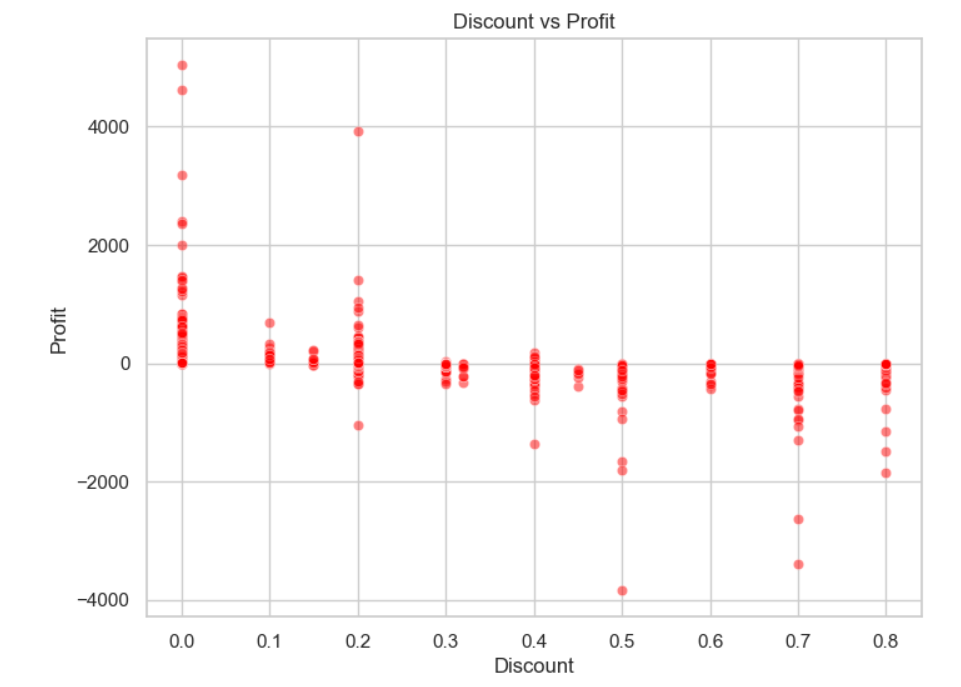
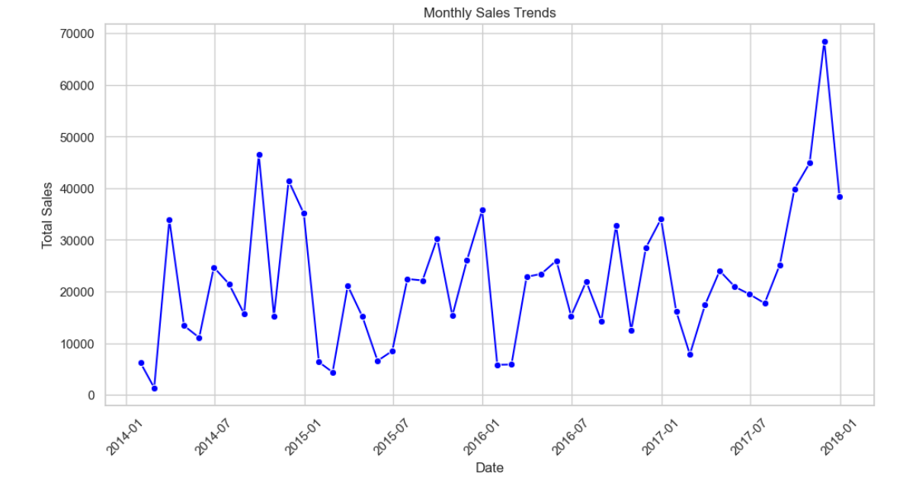
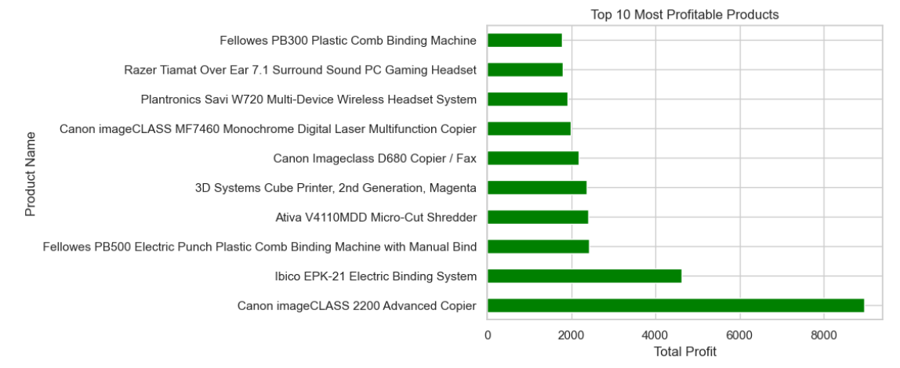

# 📊 Superstore Data Analysis with Python


> An exploratory data analysis project on the popular **Sample Superstore dataset** using `pandas`, `matplotlib`, and `seaborn`. This project uncovers trends, visualizes key business metrics, and prepares insights for decision-making.

---

## 📌 Project Highlights

- 🧹 Data loading and cleaning using Pandas
- 📅 Parsing of date columns and missing value checks
- 📈 Exploratory analysis and descriptive statistics
- 📊 Data visualization using Seaborn & Matplotlib
- 🔍 Insights into sales, profit, discounts, and customer behavior

---

## 📁 File Structure

```bash
superstore-data-analysis/
├── Sample - Superstore.csv     # Input dataset file
├── New Text Document.txt       # Main Jupyter notebook (Python code)
└── README.md                   # Project documentation
```
##🚀 Getting Started
1.** Clone the repository**
```bash
git clone https://github.com/your-username/superstore-data-analysis.git
cd superstore-data-analysis
```
2.**Install the required libraries**
```bash
pip install pandas matplotlib seaborn jupyter
```
3. **Launch the Jupyter Notebook**
```bash
jupyter notebook "New Text Document.txt"
```

---

## 📊 Insight Charts Overview: Visualizing Key Business Metrics

| 📈 Plot Title                 | 📊 Chart Type    | 🧾 Columns Used             | 🔍 Purpose                            |
|------------------------------|------------------|-----------------------------|----------------------------------------|
| Total Sales by Region         | Bar Chart         | Region, Sales               | Compare regional performance           |
| Average Order Value           | Bar Chart         | Sales                       | Show mean value of all orders          |
| Sales by Category             | Bar Chart         | Category, Sales             | Identify top-selling categories        |
| Discount vs Profit            | Scatter Plot      | Discount, Profit            | Analyze discount impact on profit      |
| Monthly Sales Trends          | Line Chart        | Order Date, Sales           | View sales seasonality and trend       |
| Sales Histogram               | Histogram         | Sales                       | Understand distribution of sales       |
| Sales Boxplot                 | Boxplot           | Sales                       | Detect outliers and spread             |
| Most Frequent Customers       | Horizontal Bar    | Customer Name               | Rank frequent buyers                   |
| Most Profitable Products      | Horizontal Bar    | Product Name, Profit        | Identify best-selling products         |
| Least Profitable Products     | Horizontal Bar    | Product Name, Profit        | Spot loss-making products              |
| Total Sales, Profit, Quantity | Bar Chart         | Sales, Profit, Quantity     | Overview of key KPIs                   |

> All charts are interactive and viewable in the notebook.

---

### Sample Visualization

<table>
  <tr>
    <td></td>
    <td></td>
  </tr>
  <tr>
    <td align="center">Discount vs. Profit</td>
    <td align="center">Monthly Sales Trends</td>
  </tr>
  <tr>
    <td colspan="2" align="center"></td>
  </tr>
  <tr>
    <td colspan="2" align="center">Top 10 Most Profitble Products</td>
  </tr>
</table>

> Visualizations such as scattered plot, Line chart, and Bar charts help explore data relationships and detect trends or anomalies.

---

## 🧪 Technologies Used

| Tool         | Purpose                   |
|--------------|---------------------------|
| Python 🐍     | Programming language       |
| Pandas 📊     | Data manipulation          |
| Matplotlib 📈 | Data visualization         |
| Seaborn 🐋    | Statistical plotting       |
| Jupyter 📒    | Interactive environment    |

---

## 📜 License

This project is licensed under the **MIT License**.  
Feel free to use, share, and modify with proper attribution.

---

## 🙌 Acknowledgments

Thanks to the **Superstore dataset community** and developers of **pandas**, **matplotlib**, and **seaborn** libraries for enabling accessible and powerful data analysis.

---

## 📫 Contact

For feedback, suggestions, or questions:  
📧 **r.manisharathod6@gmail.com**
